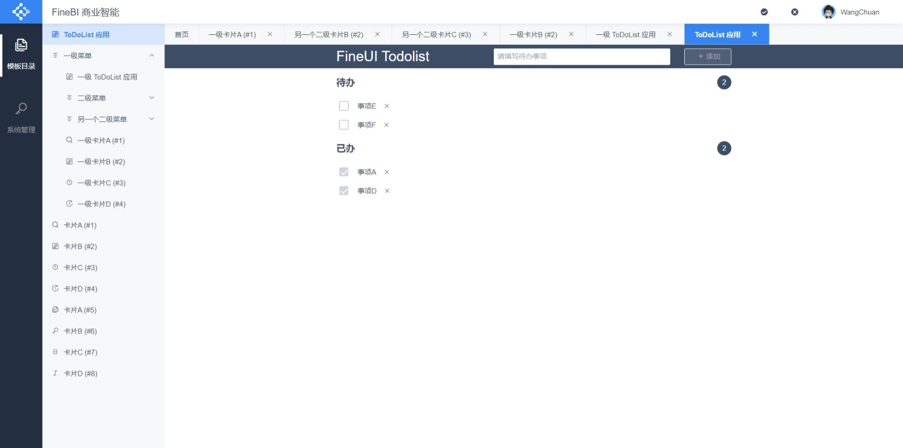

# README

## 克隆仓库

```shell
git clone https://code.fineres.com/scm/fui/fineui-starter.git
```

## 安装项目依赖

```shell
# 配置下载以及查看权限
# 账户：public
# 密码：fr123456
# 邮箱：随意，如自己的企业邮箱
npm adduser --registry https://npm.fineres.com

# 安装依赖
npm install
```

## 调试与打包项目

```shell
# 调试
# dev-url: localhost:2333
npm run start

# 打包
npm run build
```

## 格式和规范检查

```shell
# 代码格式
npm run prettier

# 代码规范
npm run eslint
npm run eslint:fix

# 样式规范
npm run stylelint
npm run stylelint:fix
```

此外，如果你使用的 编辑器/IDE 不在[这些范围](https://editorconfig.org/#pre-installed)之内，请安装 EditorConfig 扩展，以使`.editorconfig`生效。

## 项目配置

请见`src/const/configs.ts`。

## 效果预览


